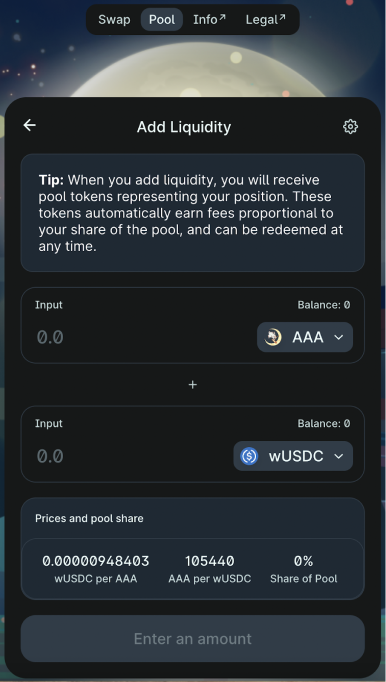

## DEX Adding and Removing Liquidity

1. Go to Pool submenu on [https://dex.moonrabbit.com/#/pool](https://dex.moonrabbit.com/#/pool/) 

    

2. Check here if pair exists: [https://info.dex.moonrabbit.com/home](https://info.dex.moonrabbit.com/home/)

3. If pair exists choose “Add liquidity” [https://dex.moonrabbit.com/#/add/AAA](https://dex.moonrabbit.com/#/add/AAA/) and add tokens in a proportion provided by DEX.

    

4. If pair does not exist choose “Create a pair” and set price of Token A in Token B adding both tokens to liquidity

    

5. As soon as liquidity is added you can remove liquidity from a pair partially or in full.

