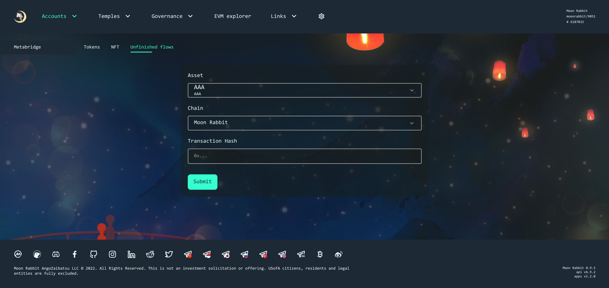

# Guide to using an Unfinished Flows
#### How to use unfinished flows?

If the user did not complete transferring he can use unfinished flows for successful completion.
For this user should change the tab to "Unfinished flows".

User should choose Asset, Chain which has transferred by him. Than he should paste TX Hash for first transaction and clicks "Submit" button.

>*If the user choose Incorrect asset or Chain for TX Hash which user has entered, he can see error message.* 

Than, user should click to the "Submit" button again. If user was connected to another network, he should click to the "Connect Chain" button.

>*Please make sure that there are enough funds on the balance to confirm the transaction.*

After this, user can see Metamask window, He should confirm the transaction and wait until to transaction will be confirmed.