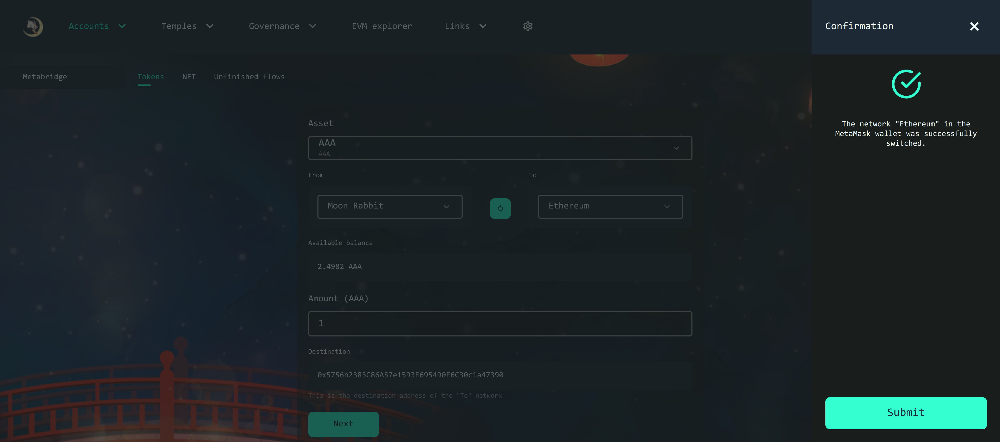

# EVM/Ethereum Tokens bridge
#### How to transfer Tokens from Moon Rabbit EVM to the Ethereum or another network?

Users can transfer his Tokens from Moon Rabbit EVM to Ethereum or another network. For this, he should add the Moon Rabbit EVM network in the Metamask.

In the beginning, a user should choose an Asset from dropdown. Then, he should choose Moon Rabbit EVM (From) and Ethereum Network (To), and clicks the "Connect Chain" button if user was connected to another network. Then, user should enter amount to the "Amount(AAA)" field and clicks "Next" button.

The user can see the "Confirmation" modal window. He should check the information and check "I have read and agree to the Terms of Use" and clicks "Confirm". After this, he should confirm the transaction in the Metamask.

>*Please make sure that there are enough funds(AAA) on the balance to confirm the transaction.*

Wait until the transaction will be confirmed. After the transaction`s confirmed, a user should change the network from Moon Rabbit EVM to Ethereum by clicking the "Connect Chain" button or change manually in the Metamask and clicks to "Withdraw" button. After this, he should confirm the transaction in the Metamask. 

>*If the user closed the modal window without withdraw, he can find this operation on the "Unfinished flows" tab.

>*Please make sure that there are enough funds(ETH) on the balance to confirm the transaction.*

User should clicks to "Submit" button.

Wait until the transaction will be confirmed.

