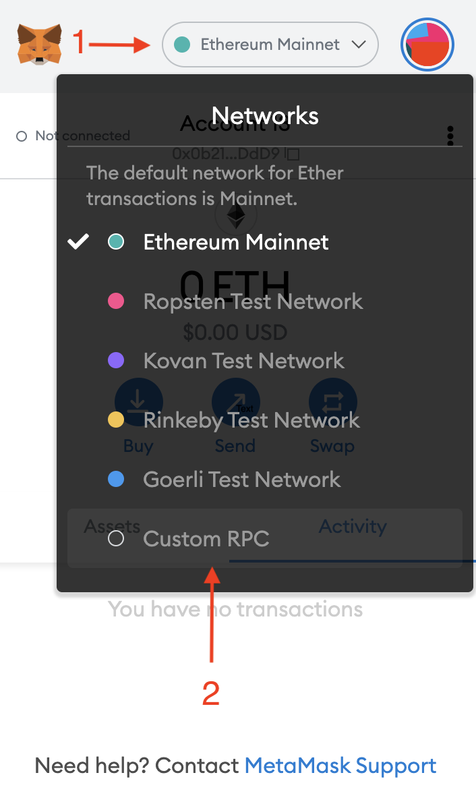
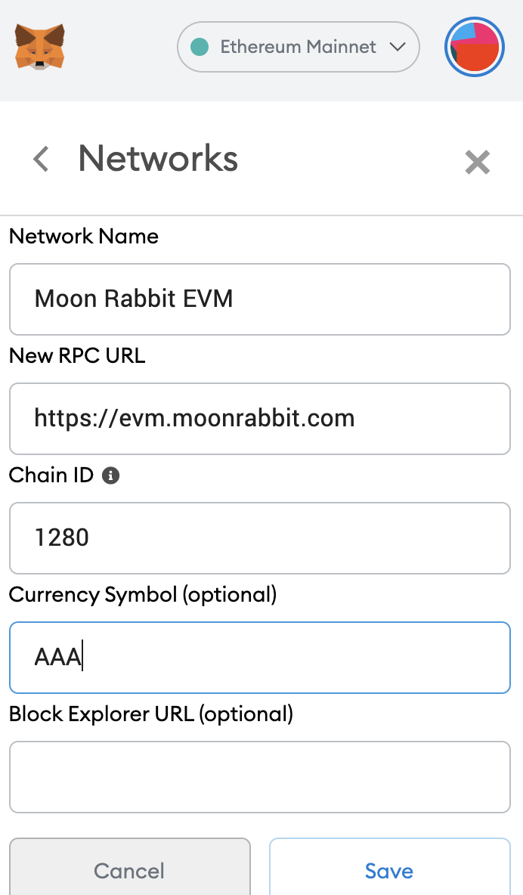

# Connecting to Metamask

Open Metamask and click on "Networks" on top of the screen and select Custom RPC.

Enter the network data and click "Save".

The settings for mainnet and testnet are listed below:

**Mainnet**

- Network Name: `Moon Rabbit EVM`
- New RPC URL: `https://evm.moonrabbit.com`
- Chain ID: `1280`
- Currency Symbol: `AAA`
- Block Explorer URL: `https://scan.moonrabbit.com/`

**Testnet**

- Network Name: `Moon Rabbit EVM Testnet`
- New RPC URL: `https://testnetevm.moonrabbit.com`
- Chain ID: `1280`
- Currency Symbol: `AAA`
- Block Explorer URL: `https://scan.testnet.moonrabbit.com`